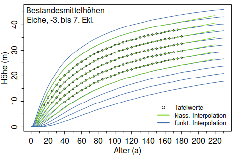
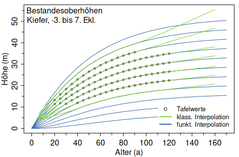

<!-- README.md is generated from README.Rmd. Please edit that file -->

# et.nwfva

<!-- badges: start -->

[](https://github.com/rnuske/et.nwfva/actions/workflows/R-CMD-check.yaml)
[](https://cloud.drone.io/rnuske/et.nwfva)
[](https://www.gnu.org/licenses/gpl-2.0.html)
[](https://doi.org/10.5281/zenodo.7207596)
<!-- badges: end -->

Die neuen Ertragstafeln der NW-FVA (Albert et al. 2021) bieten für die
fünf Hauptbaumarten Eiche, Buche, Fichte, Douglasie und Kiefer ein
Planungsinstrument, welches das aktuelle Zuwachsniveau der Wälder
Nordwestdeutschlands widerspiegelt und das empfohlene waldbauliche
Behandlungskonzept einer gestaffelten Hochdurchforstung unterstellt.

Neben den Tafelwerten bietet `et.nwfva` sowohl die Möglichkeit zu
bonitieren als auch Bestandeshöhen und Tafelwerte für beliebige
Bonitäten und Alter zu bestimmen. Für die Inter- und Extrapolation
kommen standardmäßig funktionale Bonitätsfächer zum Einsatz, aber die
klassische Methode mittels Dreisatz steht ebenfalls zur Verfügung. Die
funktionale Interpolation kann den Bereich von der -3. bis 7.
Ertragsklasse und den gesamten Altersbereich bedienen. Die klassische
Interpolation ist auf den Bonitätsbereich -2. bis 4. Ertragsklasse und
den Altersbereich 5 bis max. zulässiges Alter (Ei 220, Bu 180 und Fi,
Dgl, Ki 160) beschränkt.



## Installation

Die aktuelle Version des Paketes kann für die gängigen Betriebssysteme
(Windows, Linux, macOS) aus dem [R-Universe der
NW-FVA](https://nw-fva.r-universe.dev) installiert werden.

``` r
# NW-FVA Universe in R bekannt machen
options(repos = c(
  nwfva = "https://nw-fva.r-universe.dev",
  CRAN = "https://cloud.r-project.org"))

# und Paket wie gewohnt installieren
install.packages("et.nwfva")
```

Die Entwicklerversion kann mit dem Paket `remotes` direkt aus
[Github](https://github.com/rnuske/et.nwfva) kompiliert und installiert
werden.

``` r
remotes::install_github("rnuske/et.nwfva")
```

## Beispiele

Einen Überblick über die vorhandenen Tafeln liefert `et_liste()` und
Detailinformationen zu einer Tafel `et_info()`. Ganze Tafeln einer
Baumart oder Auszüge aus einer Tafel, z.B. für bestimmte Bonitäten oder
Alter, bietet `et_tafel()`.

``` r
library(et.nwfva)

# Ertragstafelwerte für Buche 1. Ertragsklasse ausgeben (hier: Zeilen 1 bis 6)
head(et_tafel("Buche", bon=1))
#>   Ekl Alter    N   Hg H100    G   Dg   Dw   V N_aus G_aus Dg_aus V_aus   iV GWL dGZ
#> 1   1    35 3028  9.7 12.9 13.2  7.5 11.2  54  1518   5.5    6.8    24  9.5 111 3.2
#> 2   1    40 2083 12.3 15.3 15.2  9.7 14.4  82   945   4.9    8.1    28 11.1 167 4.2
#> 3   1    45 1487 14.7 17.5 16.9 12.0 17.7 112   596   4.4    9.7    31 12.2 228 5.1
#> 4   1    50 1104 16.9 19.5 18.3 14.5 21.1 143   382   4.1   11.7    34 13.0 293 5.9
#> 5   1    55  879 18.9 21.4 19.6 16.8 24.5 174   225   3.9   14.9    36 13.5 361 6.6
#> 6   1    60  721 20.7 23.1 20.8 19.1 27.8 206   159   3.7   17.2    38 13.9 430 7.2


# Eine Ertragstafelzeile interpoliert für Fichte 2.4. Ekl. und Alter 82
et_tafel("Fi", bon=2.4, alter=82)
#>   Ekl Alter   N   Hg H100    G   Dg   Dw     V N_aus G_aus Dg_aus V_aus   iV   GWL dGZ
#> 1 2.4    82 672 25.3 26.3 39.1 27.4 38.9 436.8    42     3   30.1  32.8 12.9 768.6 9.4
```

Die Bonitierung von Beständen erfolgt mit `et_bonitaet()` anhand von
Bestandesalter und -höhe standardmäßig über funktionale Bonitätsfächer.
Auf Wunsch ist auch die klassische Bonitierung mittels Dreisatz
verfügbar. Im Fall der Interpolation zwischen den Tafelwerten
unterscheiden sich die Verfahren kaum, aber im Extrapolationsbereich
können die Abweichungen durchaus beachtlich sein (siehe Abbildung oben).

``` r

# Ertragsklasse eines 80 jährigen Eichenbestandes mit der Mittelhöhe 16m
et_bonitaet("Eiche", alter=80, hoehe=16)
#> [1] 3.8
et_bonitaet("Eiche", alter=80, hoehe=16, methode="klassisch")
#> [1] 3.9
```

Sollte im Hinblick auf das Alter und/oder die Bestandeshöhe eine
Extrapolation der Tafelwerte notwendig sein, gibt die klassische Methode
einen Hinweis aus. Falls dabei der zulässige Extrapolationsbereich
verlassen würde, geben beide Methoden eine Warnung und je nach Wert des
Parameters `kapp_na` den jeweiligen Grenzwert oder `NA` zurück.

``` r
# Ertragsklasse eines 120 jährigen Kiefernbestandes mit Oberhöhe 32m
et_bonitaet("Kiefer", alter=120, hoehe=45, hoehe_typ="ober", methode="funktional")
#> [1] -2.4
et_bonitaet("Kiefer", alter=120, hoehe=45, hoehe_typ="ober", methode="klassisch")
#> Für die Ertragsklasse(n) '-1' ist das höchste Alter in der Tafel '90'. Es wurde auf das Alter '120' extrapoliert.
#> [1] -1.8

# Anfrage außerhalb des zulässigen Bonitätsbereichs
et_bonitaet("Kiefer", alter=70, hoehe=40, hoehe_typ="ober")
#> Warning in funk_bonitieren(art, alter, h = hoehe, h_als_hg = isTRUE(hoehe_typ == : Die
#> Bestandeshöhe 40 im Alter 70 ergibt eine Bonität außerhalb des Extrapolationsbereiches
#> [-3,7]. Da kapp_na=TRUE, wurde die Bonität auf NA gesetzt!
#> [1] NA
```

Die Bestandeshöhenwerte für die Abbildungen oben wurden mit der Funktion
`et_hoehe()` berechnet. Umrechnungen von relativen Ertragsklassen in
absolute Oberhöhenbonitäten (Oberhöhe H100 im Alter 100 in Metern) und
umgekehrt ermöglicht die Funktion `et_bontrans()`.

``` r
# Bestandesmittelhöhe für Buche im Alter 75 und 1.25. Ekl.
et_hoehe("bu", alter=75, bon=1.25, hoehe_typ="mittel")
#> [1] 24.4
et_hoehe("bu", alter=75, bon=1.25, hoehe_typ="mittel", methode="klass")
#> [1] 24.4


# Umrechnung von der Oberhöhenbonität 27 zur relativen Ertragsklasse für Kiefer
et_bontrans("Kiefer", bon=27, richtung="abs_zu_rel")
#> [1] 1.5
```

## Literatur

Albert M., Nagel J., Schmidt M., Nagel R.-V., Spellmann H. (2021): Eine
neue Generation von Ertragstafeln für Eiche, Buche, Fichte, Douglasie
und Kiefer \[Datensatz\]. Version 1.0. Zenodo.
<https://doi.org/10.5281/zenodo.6343906>
